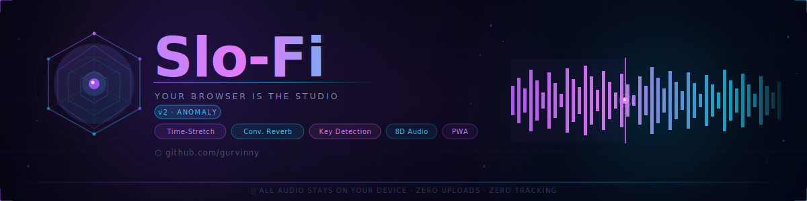

<div align="center">



<br/>

# Contributing to Slo-Fi

### ✦ Help build the late-night studio ✦

[](LICENSE)
[](#submitting-a-pull-request)
[](#code-style)
[](#development-setup)

<p>
  <a href="#ways-to-contribute">Ways to Contribute</a> •
  <a href="#development-setup">Development Setup</a> •
  <a href="#branch-and-commit-conventions">Conventions</a> •
  <a href="#pull-request-checklist">PR Checklist</a> •
  <a href="#code-style">Code Style</a>
</p>

</div>

<br/>

---

<br/>

Slo-Fi is a professional-grade browser audio tool built entirely on the Web Audio API. It processes audio 100% client-side — no uploads, no tracking, no dependencies at runtime. Contributions that align with that philosophy are the most welcome.

This guide covers everything you need to get from idea to merged PR.

<br/>

---

<br/>

## Ways to Contribute

**Report a Bug**
Open an [issue](https://github.com/gurvinny/slo-fi/issues/new) with:
- Browser and OS
- Steps to reproduce
- Expected vs. actual behavior
- Console errors if any

**Suggest a Feature**
Open an [issue](https://github.com/gurvinny/slo-fi/issues/new) tagged `enhancement`. Check the [v2.0 roadmap in the README](README.md#v20--dark-glass-redesign) first — it may already be planned.

**Submit Code**
Bug fixes, performance improvements, new features that fit the project direction. See [Pull Request Checklist](#pull-request-checklist) before opening.

**Improve Docs**
Fix typos, improve explanations, or add examples to any `.md` file or inline code comments.

**Report a Security Issue**
Do not open a public issue. See [SECURITY.md](SECURITY.md) for the responsible disclosure process.

<br/>

---

<br/>

## Development Setup

### Prerequisites

- **Node.js ≥ 18**
- A modern browser (Chrome, Firefox, Safari, Edge — all supported)
- Git

### Steps

```bash
# 1. Fork the repo on GitHub, then clone your fork
git clone https://github.com/<your-username>/slo-fi.git
cd slo-fi

# 2. Install dependencies
npm install

# 3. Start the dev server (Vite with HMR)
npm run dev
# App available at http://localhost:5173

# 4. Type-check the project
npm run lint

# 5. Build for production
npm run build

# 6. Preview the production build
npm run preview
```

The project has no runtime dependencies — everything ships bundled. The only dev tools are TypeScript and Vite.

<br/>

---

<br/>

## Branch and Commit Conventions

### Branch Names

```
feat/<short-description>       new feature
fix/<short-description>        bug fix
docs/<short-description>       documentation only
chore/<short-description>      tooling, deps, config
perf/<short-description>       performance improvement
refactor/<short-description>   code restructuring without behavior change
```

### Commit Messages

This project follows [Conventional Commits](https://www.conventionalcommits.org/):

```
feat: add loop region selection to waveform
fix: prevent ConvolverNode clipping at high reverb mix
docs: update CONTRIBUTING with Node version requirement
chore: bump Vite to 8.0
perf: defer OfflineAudioContext creation until export
```

- Use the imperative, present tense: "add" not "added"
- Keep the subject line under 72 characters
- Add a body for non-obvious changes explaining the *why*

<br/>

---

<br/>

## Pull Request Checklist

Before opening a PR, confirm all of the following:

- [ ] `npm run lint` passes with no errors
- [ ] No `any` types introduced (TypeScript strict mode is enforced)
- [ ] No `console.log` statements left in production paths
- [ ] Audio processing remains entirely client-side — no network calls for audio data
- [ ] New UI elements follow the existing dark-mode aesthetic (dark backgrounds, neon accents)
- [ ] No new runtime dependencies added without prior discussion in an issue
- [ ] The PR title follows Conventional Commits format
- [ ] The PR description explains *what* changed and *why*

<br/>

---

<br/>

## Code Style

The project uses **TypeScript in strict mode**. The compiler enforces:

- `strict: true` — all strict checks enabled
- `noUnusedLocals: true` — no dead variables
- `noUnusedParameters: true` — no dead function parameters
- `noImplicitReturns: true` — all code paths return

### Patterns to Follow

**Module structure** — code is organized into three modules:
```
src/audio/    Web Audio API engine (AudioEngine, EffectsChain, Exporter, etc.)
src/ui/       DOM controllers (App, Waveform, SpectrumAnalyzer, etc.)
```

**Web Audio API** — prefer native nodes over manual DSP. The `AudioContext` instance is owned by `AudioEngine` and passed down — never create a second context.

**No `any`** — if a type is unknown, use `unknown` and narrow it. If a browser API lacks types, extend the interface rather than casting to `any`.

**DOM queries** — use typed `querySelector` calls. If an element must exist, assert it with a guard rather than allowing silent nulls.

```typescript
// Good
const canvas = document.querySelector<HTMLCanvasElement>('#waveform');
if (!canvas) throw new Error('Waveform canvas not found');

// Avoid
const canvas = document.querySelector('#waveform') as any;
```

**Audio data stays local** — any change that causes audio bytes to leave the browser will be rejected outright, regardless of opt-in state.

<br/>

---

<br/>

## Questions

If you're unsure whether something is in scope or need help navigating the codebase, open an issue tagged `question`. The architecture is intentionally lean — most additions fit cleanly into one of the three module directories.

<br/>

---

<br/>

<div align="center">

<sub><a href="README.md">Back to README</a> • <a href="CODE_OF_CONDUCT.md">Code of Conduct</a> • <a href="SECURITY.md">Security</a></sub>

</div>
